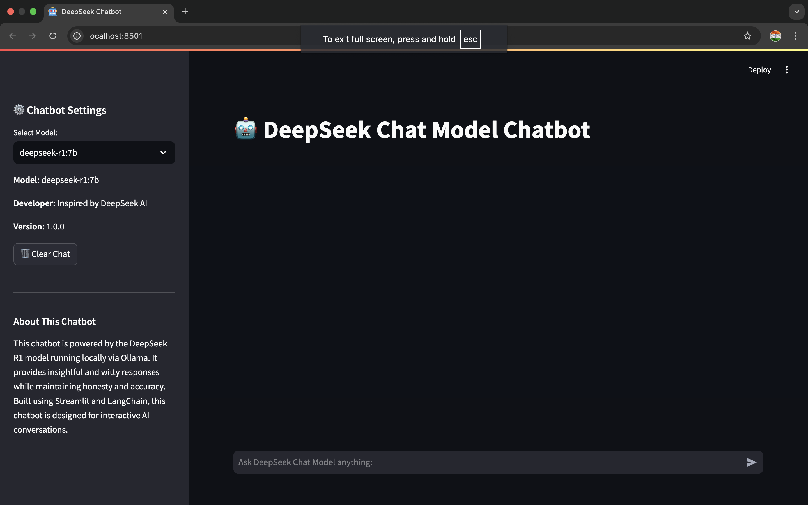

# DeepSeek Chatbot with Ollama

This repository contains a Streamlit-based chatbot that runs locally using the DeepSeek R1 model via Ollama. It provides intelligent, insightful, and witty responses while maintaining honesty and helpfulness.

## Features
- Local execution using Ollama and DeepSeek R1 model
- Interactive chat with stored session history
- Response regeneration option
- Sidebar with chatbot settings and model details
- Simple and user-friendly UI with Streamlit

## Installation
### Prerequisites
Make sure you have the following installed:
- Python 3.8+
- Ollama ([Installation Guide](https://ollama.com))
- DeepSeek R1 model (`deepseek-r1:7b`)
- VS Code (optional but recommended)

### Step 1: Install Ollama
#### Download and Install Ollama:
- Visit the Ollama website and download the macOS version.
- Open the downloaded `.dmg` file, drag the Ollama application to your Applications folder, and then open it.

#### Verify Installation:
Open Terminal and run:
```bash
ollama --version
```
This should display the installed version of Ollama.

### Step 2: Pull the DeepSeek R1 Model
#### Run the Command to Pull the Model:
For simplicity, let's start with the 7B model:
```bash
ollama pull deepseek-r1:7b
```
This command will download the DeepSeek R1 model. You can choose a different size based on your MacBook's specs:
- `deepseek-r1:1.5b`
- `deepseek-r1:8b`
- `deepseek-r1:14b`
- `deepseek-r1:32b`
- `deepseek-r1:70b`

#### List Models to Verify Download:
Check if the model has been added:
```bash
ollama list
```

### Step 3: Install Python and Required Packages
#### Ensure Python is Installed:
You should have Python installed. Check with:
```bash
python3 --version
```
If not, install via Homebrew:
```bash
brew install python
```

#### Install Streamlit and Other Dependencies:
Open a new Terminal window or tab and run:
```bash
pip install streamlit langchain langchain_community transformers openai
```

### Clone the Repository
```sh
git clone https://github.com/your-username/deepseek-chatbot.git
cd deepseek-chatbot
```

### Install Dependencies
Create a virtual environment (optional but recommended):
```sh
python -m venv venv
source venv/bin/activate  # On Windows use: venv\Scripts\activate
```

Install required Python packages:
```sh
pip install -r requirements.txt
```

## Running the Chatbot
1. Start Ollama in the background:
```sh
ollama run deepseek-r1:7b
```

2. Run the chatbot script:
```sh
streamlit run chatbot.py
```

## Project Structure
```
📁 deepseek-chatbot
│── chatbot.py      # Main chatbot script
│── requirements.txt # Required Python dependencies
│── README.md       # Documentation
```

## Usage
- Open your browser at `http://localhost:8501`
- Start chatting with the DeepSeek Chatbot!
- Use the **Regenerate Response** button if needed.
- Click **Clear Chat** in the sidebar to reset the conversation.


## DeepSeek Chatbot UI Preview

Here’s how the chatbot looks when running locally:




## Contributing
Feel free to submit pull requests and issues to improve the chatbot.

## License
This project is licensed under the MIT License.

